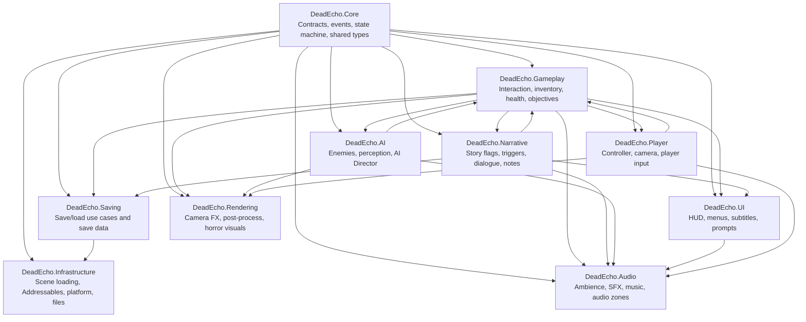

# Dead Echo — Initial Architecture Guidelines

## 1. Architecture Decision Summary

Dead Echo should use a **modular Unity-first architecture** focused on immersion, maintainability, fast iteration, and production stability.

The recommended foundation is:

- Unity 6.4 Supported as the initial project version.
- GameObject/MonoBehaviour-based gameplay architecture.
- Assembly Definitions for clear module boundaries.
- Lightweight Dependency Injection using VContainer.
- Partial Hexagonal/Clean Architecture principles only where they add value.
- ScriptableObject-driven configuration.
- GameStateMachine for application flow.
- Strong separation between gameplay logic, presentation, infrastructure, and editor tooling.

The project should avoid overengineering. The goal is not to make the architecture look complex, but to make the game easier to build, test, debug, scale, and eventually ship.

---

## 2. Assembly Definition Strategy

Assembly Definitions are mandatory for Dead Echo.

They provide:

- Faster compile times.
- Better separation between systems.
- Safer module dependencies.
- Cleaner namespaces.
- Less accidental coupling.
- Better long-term maintainability.

### Recommended Runtime Assemblies

```txt
DeadEcho.Core
DeadEcho.Infrastructure
DeadEcho.Gameplay
DeadEcho.Player
DeadEcho.AI
DeadEcho.Audio
DeadEcho.Narrative
DeadEcho.UI
DeadEcho.Saving
DeadEcho.Rendering
DeadEcho.Tools.Runtime
```

### Recommended Editor Assemblies

```txt
DeadEcho.Editor
DeadEcho.AI.Editor
DeadEcho.Narrative.Editor
DeadEcho.Tools.Editor
```

Editor assemblies must never be referenced by runtime assemblies.

---

## 3. Module Responsibilities

### DeadEcho.Core

Core contains the most stable and dependency-light parts of the project.

Responsibilities:

- Shared interfaces.
- Base state machine contracts.
- Common events.
- Core value objects.
- Common result/error types.
- Time abstraction.
- Service contracts.
- Utility types that do not depend on gameplay.

Rules:

- Must not depend on Gameplay, UI, Audio, AI, Narrative, Saving, or Infrastructure.
- Must not reference Unity scene objects directly unless absolutely generic.
- Should remain small and stable.

---

### DeadEcho.Infrastructure

Infrastructure implements technical services and external adapters.

Responsibilities:

- Scene loading implementation.
- Addressables asset loading.
- File system access.
- Save repository implementation.
- Platform services.
- Input persistence.
- Analytics or telemetry adapters.

Rules:

- Can depend on Core.
- Can implement interfaces defined in Core or feature modules.
- Should not contain gameplay rules.

---

### DeadEcho.Gameplay

Gameplay contains shared gameplay systems that are not specific only to the player or enemies.

Responsibilities:

- Interaction system.
- Health/damage contracts.
- Inventory runtime logic.
- Objectives runtime logic.
- Trigger systems.
- Game rules for level interaction.

Rules:

- Can depend on Core.
- Can depend on Narrative only through explicit contracts if needed.
- Should not directly control UI screens.
- Should communicate with UI through events or interfaces.

---

### DeadEcho.Player

Player contains player-specific systems.

Responsibilities:

- Player controller.
- Camera control.
- Player input handling.
- Player interaction adapter.
- Player health.
- Player inventory bridge.
- First-person presentation logic.

Rules:

- Can depend on Core and Gameplay.
- Should not depend directly on UI implementation.
- Should not contain global game state logic.

---

### DeadEcho.AI

AI contains enemy behavior, perception, and director systems.

Responsibilities:

- Enemy state machines.
- Behavior tree adapters, if used.
- AI perception.
- Enemy movement logic.
- AI Director.
- Suspicion, alert, investigation, chase, search states.

Rules:

- Can depend on Core and Gameplay.
- Should not depend on UI.
- Should not directly own narrative progression.
- Should expose events for audio/narrative/gameplay reactions.

---

### DeadEcho.Audio

Audio is a high-priority module because Dead Echo depends heavily on immersion.

Responsibilities:

- AudioManager.
- Ambience layers.
- Dynamic music.
- Audio zones.
- Reverb/occlusion control.
- SFX pooling.
- Audio event ScriptableObjects.

Rules:

- Can depend on Core.
- Can listen to gameplay/narrative/AI events.
- Should not contain gameplay decision logic.
- Should be data-driven through ScriptableObjects.

---

### DeadEcho.Narrative

Narrative controls story state, environmental storytelling, and progression flags.

Responsibilities:

- Narrative flags.
- Story triggers.
- Dialogue/subtitle data.
- Notes/documents.
- Environmental storytelling events.
- Objective narrative progression.

Rules:

- Can depend on Core.
- Can expose contracts consumed by Gameplay and UI.
- Should not directly manipulate enemy internals.
- Should request effects through events or services.

---

### DeadEcho.UI

UI contains visual presentation and screen flow only.

Responsibilities:

- Main menu.
- Pause menu.
- HUD.
- Subtitles.
- Interaction prompts.
- Inventory UI.
- Death/game over screens.
- Settings screens.

Rules:

- Can depend on Core.
- Can depend on Gameplay/Narrative contracts if necessary.
- Should not contain gameplay rules.
- Should not directly mutate domain state without going through services/use cases.

---

### DeadEcho.Saving

Saving controls persistence contracts and save/load use cases.

Responsibilities:

- Save game use cases.
- Load game use cases.
- Checkpoint state.
- Save data models.
- Serialization contracts.

Rules:

- Can depend on Core.
- Can depend on feature contracts when needed.
- File implementation should live in Infrastructure.
- Should not depend directly on UI.

---

### DeadEcho.Rendering

Rendering contains visual systems that are not pure gameplay.

Responsibilities:

- Post-processing controllers.
- Camera effects.
- Horror visual effects.
- Fog/light controllers.
- Screen damage effects.
- Environment visual reactions.

Rules:

- Can depend on Core.
- May listen to gameplay events.
- Should not own gameplay state.

---

## 4. Boundary Graph



### Important Interpretation

The graph shows conceptual communication direction, not permission to freely reference everything.

Preferred communication should happen through:

- Interfaces.
- Events.
- ScriptableObject channels.
- Use cases.
- VContainer-injected services.

Avoid direct concrete references between high-level systems.

---

## 5. Allowed and Forbidden Access Rules

### Core

Allowed:

```txt
Core -> nothing project-specific
```

Forbidden:

```txt
Core -> Gameplay
Core -> UI
Core -> Audio
Core -> AI
Core -> Narrative
Core -> Infrastructure
Core -> Saving
```

Core must be the most independent assembly.

---

### Gameplay

Allowed:

```txt
Gameplay -> Core
Gameplay -> Narrative contracts only, when needed
Gameplay -> Audio contracts/events only, when needed
```

Forbidden:

```txt
Gameplay -> UI concrete screens
Gameplay -> Infrastructure concrete classes
Gameplay -> Editor assemblies
```

---

### UI

Allowed:

```txt
UI -> Core
UI -> Gameplay contracts/view models
UI -> Narrative contracts/view models
```

Forbidden:

```txt
UI -> enemy AI internals
UI -> direct save file implementation
UI -> direct scene loading implementation unless through service contract
```

---

### AI

Allowed:

```txt
AI -> Core
AI -> Gameplay contracts
AI -> Audio events/contracts
```

Forbidden:

```txt
AI -> UI
AI -> Save implementation
AI -> Narrative concrete progression logic
```

---

### Audio

Allowed:

```txt
Audio -> Core
Audio listens to events from Gameplay, AI, Narrative, Player
```

Forbidden:

```txt
Audio -> gameplay decisions
Audio -> objective completion logic
Audio -> scene flow ownership
```

---

### Infrastructure

Allowed:

```txt
Infrastructure -> Core
Infrastructure -> Saving contracts
Infrastructure -> Addressables/Unity APIs
```

Forbidden:

```txt
Infrastructure -> gameplay rules
Infrastructure -> UI logic
Infrastructure -> AI behavior logic
```

---

## 6. Dependency Injection with VContainer

Dead Echo should use **VContainer** as a lightweight Dependency Injection framework.

The goal is to compose systems cleanly without relying on uncontrolled global singletons.

### Use VContainer For

```txt
GameStateMachine
SceneLoader
SaveService
CheckpointService
InputService
SettingsService
AudioService
NarrativeService
ObjectiveService
InventoryService
AI Director
Addressables/AssetProvider
Telemetry/Analytics service
Debug tools
```

### Avoid VContainer For

```txt
Small MonoBehaviours with only local behavior
Pure visual effects
Simple trigger scripts
Animation event receivers
One-off scene props
Small components with no external dependencies
Very frequently spawned tiny objects unless using factories/pools intentionally
```

### Recommended Rule

Use DI for systems. Do not use DI for every component.

A good dependency injection target usually has at least one of these characteristics:

- It coordinates multiple systems.
- It has replaceable implementations.
- It needs to be tested independently.
- It survives scene transitions.
- It represents application-level behavior.
- It hides infrastructure details.

### Example Composition Root

```txt
ProjectLifetimeScope
├── Core services
├── Infrastructure services
├── Save services
├── Audio services
├── Narrative services
├── Gameplay services
└── State machine registration
```

Scene-specific dependencies can be registered in scene lifetime scopes when needed.

---

## 7. Hexagonal Architecture Decision

Dead Echo should not use full Hexagonal Architecture everywhere.

Use Hexagonal/Clean Architecture concepts only in systems where separation from Unity improves quality.

### Good Candidates

```txt
Save System
Narrative System
Objective System
Inventory System
Settings System
AI Director
Progression System
```

### Poor Candidates

```txt
Player movement
Camera shake
Animation controllers
Enemy hit reactions
Particle effects
Simple interaction triggers
Door opening animations
UI transitions
```

### Recommended Approach

Use this split where valuable:

```txt
Domain
- Pure rules and state

Application
- Use cases and orchestration

Infrastructure
- Unity/Addressables/File implementation

Presentation
- MonoBehaviours, UI, VFX, scene objects
```

For moment-to-moment gameplay, prefer clean Unity composition over heavy architecture.

---

## 8. Clean Code Rules

### General Code Rules

```txt
- Keep classes small and focused.
- Avoid large Update methods.
- Avoid god classes and manager classes with unrelated responsibilities.
- Prefer composition over deep inheritance.
- Use interfaces only where there is a real boundary or multiple implementations.
- Avoid premature abstraction.
- Avoid stringly-typed systems when enums, IDs, ScriptableObjects, or constants are safer.
- Keep domain logic outside MonoBehaviours when practical.
- Keep presentation logic separate from gameplay decisions.
- Keep infrastructure code away from gameplay rules.
- Make invalid states difficult to represent.
- Prefer explicit dependencies over hidden global access.
```

### Unity-Specific Rules

```txt
- Use [SerializeField] private instead of public fields.
- Never manually delete or edit .meta files without reason.
- Use ScriptableObjects for configuration and reusable data.
- Use prefabs consistently.
- Avoid GameObject.Find, FindObjectOfType, and broad scene searches in runtime code.
- Cache component references when used frequently.
- Avoid allocating memory repeatedly in Update.
- Use pooling for recurring runtime objects.
- Keep scene objects organized by responsibility.
- Separate Runtime and Editor code.
- Use Addressables for large or optional assets when appropriate.
- Profile early, not only at the end.
```

### Naming Rules

```txt
- Namespaces should follow assembly/module names.
- Classes and methods use PascalCase.
- Private fields use _camelCase.
- Interfaces use IName.
- ScriptableObjects should end with SO when useful.
- Config assets should be named clearly by purpose.
```

Example:

```csharp
namespace DeadEcho.Audio
{
    public sealed class AudioService : IAudioService
    {
        private readonly AudioSettingsSO _settings;
    }
}
```

---

## 9. What Should Be Mandatory

The following practices should be mandatory from the beginning of the project:

```txt
1. Assembly Definitions.
2. Clear module boundaries.
3. GameStateMachine for application flow.
4. VContainer for application-level dependency injection.
5. ScriptableObject-driven configuration.
6. Event-driven communication for UI, audio, and narrative reactions.
7. Save system separated from Unity-specific file implementation.
8. Audio system designed early, not added late.
9. New Unity Input System.
10. Addressables for large, optional, or remotely loaded assets.
11. Object pooling for repeated runtime objects.
12. No direct UI control from gameplay systems.
13. No direct gameplay rules inside UI.
14. No uncontrolled global singletons.
15. Runtime and Editor code separated.
16. Profiling from the prototype stage.
17. Basic automated tests for pure logic.
18. Clear naming and folder conventions.
19. Scene loading handled through a service/state machine.
20. Technical documentation updated with architectural decisions.
```

---

## 10. Burst, Jobs, and ECS Decision

Dead Echo should not start with ECS as the main architecture.

Recommended baseline:

```txt
GameObjects + MonoBehaviours + VContainer + Assemblies
```

Use Burst/Jobs only when profiling proves a real need.

Possible future use cases:

```txt
AI perception checks
Large spatial queries
Crowd-like enemy sensing
Procedural environment analysis
Heavy math simulations
Batch visibility/awareness calculations
```

Avoid Burst/ECS for:

```txt
Narrative
UI
Save system
Audio orchestration
Player controller
Camera logic
Scene flow
Small enemy counts
Prototype gameplay
```

ECS should be treated as a specialized optimization path, not the foundation of the project.

---

## 11. Recommended Folder Structure

```txt
Assets/
  DeadEcho/
    Runtime/
      Core/
      Infrastructure/
      Gameplay/
      Player/
      AI/
      Audio/
      Narrative/
      UI/
      Saving/
      Rendering/
      Tools/
    Editor/
      CoreEditor/
      AIEditor/
      NarrativeEditor/
      ToolsEditor/
    Art/
    Audio/
    Scenes/
    Prefabs/
    ScriptableObjects/
    Addressables/
    Settings/
    Tests/
      EditMode/
      PlayMode/
```

---

## 12. Final Recommended Architecture

The recommended architecture for Dead Echo is:

```txt
Modular Unity architecture
+ Assembly Definitions
+ VContainer lightweight DI
+ GameStateMachine
+ ScriptableObject-driven configs
+ Event-driven communication
+ Partial Clean/Hexagonal Architecture for domain-heavy systems
+ MonoBehaviour-first gameplay
+ Burst/Jobs only for measured hotspots
+ ECS only if a future system clearly requires it
```

This gives Dead Echo a professional foundation while preserving the flexibility needed for a solo or small-team indie production.
