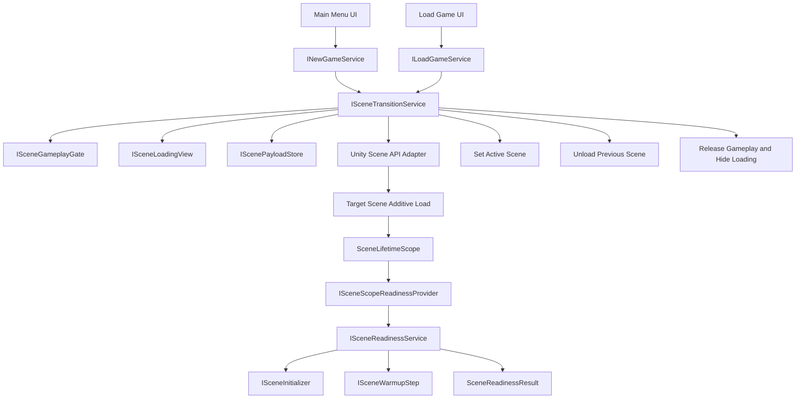

# Scene Transition Analysis

## Current Flow

Dead Echo currently starts from `Assets/_Project/Scenes/Menu.unity` during development. The scene contains `ProjectLifetimeScope`, which is the main VContainer composition root for global services, UI Toolkit menu controllers, modal services, settings services, input, and the application state machine.

`ProjectLifetimeScope` creates or receives a `UiRoot` backed by a `UIDocument`. The existing menu, modal, settings, load game, credits, and extras screens are routed through `IUiService`, `UiService`, `UiScreenCatalog`, and `ModalService`.

The application state machine is created by `AppStateMachineFactory`. `BootState` transitions to `MainMenuState`, and `MainMenuState` disables gameplay input, enables UI input, and shows `UiScreenId.MainMenu`.

There is an existing `ISceneLoader` contract and `UnitySceneLoader` implementation. `UnitySceneLoader` calls `SceneManager.LoadSceneAsync(sceneName)` directly in single mode and only exposes `IsLoading` and raw `AsyncOperation.progress`. It does not show a loading UI, does not control scene activation, does not warm up the target scene, and does not preserve persistent systems through an additive transition.

`TemporaryNewGameService` and `TemporaryLoadGameService` now create `SceneTransitionRequest` instances for `game_01_v0_1`. They still use temporary payloads and must be replaced by real save/session integration when gameplay systems are ready.

## Build Settings

`ProjectSettings/EditorBuildSettings.asset` now contains:

- `Assets/_Project/Scenes/Menu.unity`, enabled.
- `Assets/_Project/Scenes/game_01_v0_1.unity`, enabled.

`Assets/_Project/Scenes/game_01_v0_1.unity` is the first gameplay scene target used by the temporary New Game and Load Game adapters.

## Existing Scene and LifetimeScope Objects

- Persistent/root composition: `Assets/_Project/Infrastructure/DependencyInjection/ProjectLifetimeScope.cs`
- Scene scope: `Assets/_Project/Infrastructure/DependencyInjection/SceneLifetimeScope.cs`
- UI root: `Assets/_Project/UI/Runtime/UiRoot.cs`
- Current scene loader: `Assets/_Project/Infrastructure/SceneLoading/UnitySceneLoader.cs`
- Menu scene: `Assets/_Project/Scenes/Menu.unity`

`ProjectLifetimeScope` is the correct place to register application-wide transition services. `SceneLifetimeScope` is used by target scenes for scene-local services, scene initializers, and warmup steps. `game_01_v0_1` now contains a root `SceneLifetimeScope`.

## Problems Found

- `UnitySceneLoader` calls `SceneManager` directly and bypasses UI Toolkit, readiness, payload, and gameplay gating.
- Scene loading is single-mode, so persistent UI and services can be destroyed if they are not explicitly preserved by scene layout.
- No central transition state machine exists.
- No loading screen exists outside the scene being unloaded.
- Scene activation cannot be controlled.
- Legacy gameplay components with `Start`, `Awake`, or `OnEnable` side effects are not yet audited against `ISceneGameplayGate`.
- The current gameplay readiness steps are placeholders that validate transition context and payload, but do not yet spawn/apply save/player/camera systems.
- Build Settings are incomplete for validated scene transitions.
- Existing menu action services are placeholders, so New Game and Load Game cannot yet perform real scene transitions without target scene configuration.

## Recommended Architecture

Use the existing `ProjectLifetimeScope` as the persistent composition root. Register a singleton `ISceneTransitionService` there. Keep the loading screen attached to the persistent `UiRoot` so it survives additive scene loading and unloading.

Scene transitions should load target scenes additively with `allowSceneActivation = false`, display progress through `ISceneLoadingView`, activate only when the transition service reaches the activation phase, initialize/warm up the target scene through explicit contracts, wait a configurable frame margin, validate readiness, set the target as active, unload the previous content scene, then close the loading screen.

The service should be the only production code path that calls `SceneManager` for menu/gameplay transitions. Existing callers should depend on `ISceneTransitionService` or domain services that wrap it.

## Mermaid



## Classes To Create

- `ISceneTransitionService`
- `SceneTransitionService`
- `SceneTransitionRequest`
- `SceneTransitionResult`
- `SceneTransitionStatus`
- `SceneTransitionMode`
- `SceneTransitionProgress`
- `SceneTransitionError`
- `ISceneLoadingView`
- `ISceneReadinessService`
- `ISceneInitializer`
- `ISceneWarmupStep`
- `SceneInitializationContext`
- `SceneWarmupContext`
- `SceneReadinessResult`
- `SceneInitializationError`
- `SceneReadinessService`
- `ISceneScopeReadinessProvider`
- `SceneScopeReadinessProvider`
- `ISceneGameplayGate`
- `SceneGameplayGate`
- `IScenePayloadStore`
- `ScenePayloadStore`
- `ScenePayload`
- Unity scene API adapter for validation/loading/activation/unloading
- UI Toolkit loading view

## Classes To Alter

- `ProjectLifetimeScope`: register transition services and the loading view.
- `SceneLifetimeScope`: register scene-scoped initializers and warmup steps.
- `UnitySceneLoader`: route legacy `ISceneLoader` calls through the transition service or deprecate it.
- `TemporaryNewGameService`: call `ISceneTransitionService` once a target scene name is configured.
- `TemporaryLoadGameService`: call `ISceneTransitionService` with a save payload once a target scene name is configured.
- `UiRoot`: expose a persistent loading layer above screens and modals.

## Full Transition Flow

1. Reject if another transition is active.
2. Validate the target scene against enabled Build Settings scenes.
3. Block gameplay and UI interaction below the loading screen.
4. Store immutable payload if provided.
5. Show the loading screen.
6. Start additive `LoadSceneAsync`.
7. Keep `allowSceneActivation = false` until loading reaches the pre-activation threshold.
8. Activate the scene.
9. Resolve target scene readiness through explicit scene registrations.
10. Run `ISceneInitializer` instances ordered by `Order`.
11. Run `ISceneWarmupStep` instances ordered by `Order` and weighted by `Weight`.
12. Consume payload after initialization/warmup succeeds.
13. Wait the configured stabilization frame margin.
14. Validate final `SceneReadinessResult`.
15. Set target scene as active if requested.
16. Unload the previous content scene if requested.
17. Hide the loading screen.
18. Release gameplay and UI gate.
19. Return a result with status and final state.

## Scene Readiness Registration

Scene-local readiness belongs in the target scene's `SceneLifetimeScope`:

```csharp
builder.Register<SaveGameSceneInitializer>(Lifetime.Scoped).As<ISceneInitializer>();
builder.Register<PlayerSceneInitializer>(Lifetime.Scoped).As<ISceneInitializer>();
builder.Register<ObjectPoolWarmupStep>(Lifetime.Scoped).As<ISceneWarmupStep>();
builder.Register<GameplayUiWarmupStep>(Lifetime.Scoped).As<ISceneWarmupStep>();
```

`SceneTransitionService` does not resolve the VContainer scope directly. It asks `ISceneReadinessService`, which asks `ISceneScopeReadinessProvider` to inspect the loaded scene roots for `SceneLifetimeScope` and resolve the scene-scoped collections from that explicit bridge.

Each initializer receives `SceneInitializationContext`, including the loaded `Scene`, transition `Payload`, and original `SceneTransitionRequest`. Each warmup step receives `SceneWarmupContext` with the same data. Both report normalized local progress through `IProgress<float>`.

## Warmup Participants

Current project code does not yet expose real gameplay systems that need transition warmup. `game_01_v0_1` currently registers:

- `GameplaySceneContextInitializer`: validates that the scene and transition payload exist.
- `PlaceholderGameplayWarmupStep`: reserved integration point for future gameplay warmup.

Future target scenes should replace or extend these with explicit participants for:

- Player spawn/session initialization.
- Save data restore.
- Input map selection.
- Camera setup.
- Audio snapshot/music setup.
- AI/navmesh preparation.
- Inventory/session data application.
- HUD binding.

## Risks

- Build Settings must stay aligned with transition targets before real scene transitions can succeed.
- Target gameplay scenes need real `ISceneInitializer` and `ISceneWarmupStep` registrations before readiness represents full gameplay availability.
- Legacy systems with `Start`, `Awake`, or `OnEnable` gameplay side effects may start before the transition releases gameplay unless they check the gameplay gate or are moved behind initializers.
- Scene names in placeholder services must be replaced with configured constants or ScriptableObject configuration before production.
- Unity Test Runner validation may require running inside the Editor, not only `dotnet build`.

## Suggested Implementation Order

1. Add contracts and transition states in `Project.Core`.
2. Add payload store, gameplay gate, readiness service, Unity scene API adapter, and transition service in `Project.Infrastructure`.
3. Add UI Toolkit loading layer and loading view in `Project.UI`.
4. Register everything in `ProjectLifetimeScope`.
5. Route legacy `ISceneLoader`, New Game, and Load Game through transition service.
6. Add EditMode unit tests with fake scene APIs and fake loading view.
7. Add enabled scenes to Build Settings in Unity.
8. Introduce real scene initializers in gameplay scenes.
9. Audit gameplay `Start`, `Awake`, and `OnEnable` logic against `ISceneGameplayGate`.
