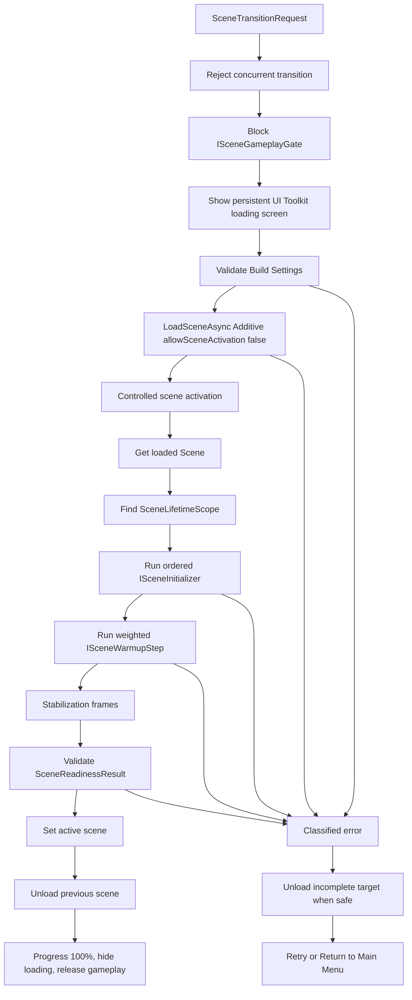

# Scene Transition System

## Summary

The scene transition system is implemented and usable for the current Main Menu to `game_01_v0_1` flow.
Progress is based on Unity async scene loading plus explicit initialization, warmup, stabilization, and readiness validation phases.
Warmup support is real, but current gameplay warmup steps are placeholders until save, player, camera, dungeon, UI, pools, and asset systems exist.
Gameplay is blocked by `ISceneGameplayGate` before loading starts and released only after the transition completes or fails safely.
The previous scene is not unloaded until target activation, initialization, warmup, stabilization, and readiness validation succeed.
Retry and Return to Main Menu are wired through the persistent loading screen, with retry only enabled for safe retryable failures.
The system is ready for MVP integration with follow-ups, not final production readiness for full gameplay.

## Overview

`ISceneTransitionService` is the single application-level entry point for scene changes. Menu services such as New Game and Load Game create `SceneTransitionRequest` instances and do not call `SceneManager` directly.

The loading screen is implemented in UI Toolkit through `ISceneLoadingView` and is attached to the persistent `UiRoot` loading layer. It shows progress, player-safe status text, error messages, Retry, and Return to Main Menu when those actions are safe.

Unity scene APIs are isolated behind `IUnitySceneOperations`. The only production `SceneManager` usage in the transition path is in `UnitySceneOperations`.

## Mermaid



## States

The service exposes `SceneTransitionStatus`:

- `Idle`
- `OpeningLoadingScreen`
- `Preparing`
- `LoadingScene`
- `WaitingForActivation`
- `ActivatingScene`
- `ResolvingSceneScope`
- `InitializingScene`
- `WarmingUpScene`
- `SwitchingActiveScene`
- `UnloadingPreviousScene`
- `ClosingLoadingScreen`
- `Completed`
- `Failed`
- `Cancelled`

## Weighted Progress

Progress does not jump to 100% from `AsyncOperation.progress`.

- Opening loading screen: `0.00` to `0.05`
- Scene data loading: `0.05` to `0.70`
- Activation: `0.70` to `0.78`
- Initialization: `0.78` to `0.92`
- Warmup: `0.92` to `0.98`
- Finalization: `0.98` to `1.00`

The values live in `SceneTransitionProgressWeights`.

## VContainer

Persistent registrations live in `ProjectLifetimeScope`:

- `ISceneTransitionService`
- `ISceneLoadingView`
- `ISceneReadinessService`
- `ISceneGameplayGate`
- `IScenePayloadStore`
- `ISceneScopeReadinessProvider`
- `IUnitySceneOperations`

Scene-local registrations live in `SceneLifetimeScope`. The current `game_01_v0_1` scene contains a root `SceneLifetimeScope`.

## Initializers

Create an initializer by implementing `ISceneInitializer`:

```csharp
public sealed class PlayerSceneInitializer : ISceneInitializer
{
    public int Order => 60;

    public Task InitializeAsync(
        SceneInitializationContext context,
        IProgress<float> progress,
        CancellationToken cancellationToken)
    {
        cancellationToken.ThrowIfCancellationRequested();
        progress.Report(1f);
        return Task.CompletedTask;
    }
}
```

Register it in the target scene scope:

```csharp
builder.Register<PlayerSceneInitializer>(Lifetime.Scoped).As<ISceneInitializer>();
```

## Warmup

Create a warmup step by implementing `ISceneWarmupStep`:

```csharp
public sealed class ObjectPoolWarmupStep : ISceneWarmupStep
{
    public int Order => 100;
    public float Weight => 2f;

    public Task WarmupAsync(
        SceneWarmupContext context,
        IProgress<float> progress,
        CancellationToken cancellationToken)
    {
        cancellationToken.ThrowIfCancellationRequested();
        progress.Report(1f);
        return Task.CompletedTask;
    }
}
```

Register it in the target scene scope:

```csharp
builder.Register<ObjectPoolWarmupStep>(Lifetime.Scoped).As<ISceneWarmupStep>();
```

## Gameplay Gate

`ISceneGameplayGate` is blocked before loading starts and released in `finally`. Gameplay systems that run in `Start`, `Awake`, `OnEnable`, timers, input handlers, AI, spawn systems, combat, and dungeon logic must check the gate or move real startup work into scene initializers.

The system does not rely on `Time.timeScale = 0`.

## Payload

`ScenePayload` passes transition data such as:

- `EntryKind`
- save ID
- spawn point
- dungeon ID
- seed
- return target

Payload is stored before loading, read through `SceneInitializationContext` and `SceneWarmupContext`, consumed after initialization/warmup succeeds, and cleared in `finally`.

## Error Handling

Errors are classified with `SceneTransitionErrorPolicy`:

- `Recoverable`
- `Retryable`
- `Fatal`

Handled codes:

- `SceneNotFound`
- `LoadingStartFailed`
- `InitializationFailed`
- `InvalidSave`
- `CorruptedSave`
- `AddressablesFailed`
- `Timeout`
- `LifetimeScopeMissing`
- `CriticalInitializerMissing`
- `Cancelled`
- `UnloadFailed`
- `SetActiveSceneFailed`

The player sees only concise localized messages. Technical details are logged with transition ID, previous scene, target scene, state, duration metrics, exception, and stack trace.

Retry is enabled only when the previous scene was not unloaded and the error policy allows retry. The failed target scene is unloaded before retry when it was partially activated.

Return to Main Menu clears transient payload and starts a new transition to `Menu` when possible.

## Diagnostics

`SceneTransitionResult.Diagnostics` contains:

- loading screen open duration
- scene load duration
- activation duration
- initialization duration
- warmup duration
- unload duration
- total transition duration

These are local diagnostics only; no analytics backend is used.

## Adding a New Scene

1. Add the scene to Build Settings.
2. Add a root `SceneLifetimeScope`.
3. Register scene-specific initializers and warmup steps.
4. Keep gameplay startup behind `ISceneGameplayGate` or explicit initializers.
5. Start transitions through `ISceneTransitionService` or an application service that wraps it.

## Starting a Transition

```csharp
await sceneTransitionService.TransitionAsync(
    new SceneTransitionRequest("game_01_v0_1")
    {
        Payload = new ScenePayload("NewGame"),
        MinimumLoadingScreenDuration = 0.5f
    },
    cancellationToken);
```

## Review Notes

- `SceneTransitionService` owns orchestration, state, retry policy, cleanup, diagnostics, and final gameplay release.
- UI Toolkit view only presents state and invokes callbacks provided by the service.
- VContainer scene resolution is isolated behind `ISceneScopeReadinessProvider`.
- There is no global service locator in controllers or views.
- `SceneManager` is isolated in `UnitySceneOperations`; tests also use `SceneManager.GetActiveScene()` for fake context.
- `DontDestroyOnLoad` still exists in legacy singleton utilities, but the transition system does not add new static singletons.

## Current Limitations

- `game_01_v0_1` uses placeholder readiness steps.
- Real save validation, corrupted save detection, Addressables failures, player spawn, camera binding, dungeon readiness, gameplay UI readiness, and pool warmup still need real implementations.
- Unity Editor PlayMode tests were not executed in this pass; validation was done through assembly builds.
- Layout was not visually rechecked at 1280x720, 1920x1080, ultrawide, or 16:10 in this pass.
- Return to Main Menu depends on `Menu` being available in Build Settings.
