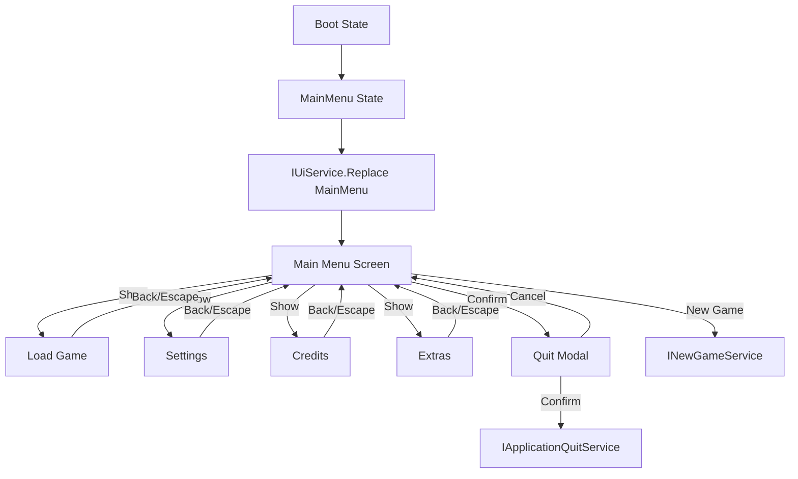

# Dead Echo Main Menu UI

## Overview

The main menu uses Unity UI Toolkit with one root `UIDocument`, a main screen layer, a modal layer, and an interaction blocker. Navigation is centralized in `IUiService`; modal flow is centralized in `IModalService`.

The current menu is functional but still contains integration placeholders for gameplay save/load and new game scene flow. Those placeholders are intentionally isolated behind application service interfaces.

## Architecture

- `UiRoot` owns the root `UIDocument` visual tree and creates three layers: `screen-layer`, `interaction-blocker`, and `modal-layer`.
- `UiService` owns current screen state, stack navigation, Escape handling, focus restoration, and screen lifecycle.
- `UiNavigationStack` stores previous screen controllers for `Back`.
- `UiScreenCatalog` maps `UiScreenId` values to screen factories.
- Screen controllers implement `IUiScreenController`; controllers that request navigation also implement `IUiNavigationRequestSource`.
- `ModalService` owns one active modal at a time and blocks interaction with the screen underneath.
- Screen controllers depend on application-facing interfaces, not gameplay implementations.

## Navigation Flow



## VContainer Registration

The composition root is `ProjectLifetimeScope`.

It registers:

- `UiRoot` as the scene component when assigned, or creates a runtime root fallback.
- `UiNavigationStack` as singleton.
- Screen controllers as transient.
- Screen factories as singleton delegates.
- `UiScreenCatalog` as singleton.
- `ModalService` as singleton implementing `IModalService`.
- `UiService` as singleton implementing `IUiService`.
- Settings, save, new game, load, delete, credits, and quit services behind core interfaces.

Controllers do not resolve the container and do not access gameplay systems directly.

## Creating A New Screen

1. Add a value to `UiScreenId`.
2. Create a controller implementing `IUiScreenController`.
3. If the screen requests navigation, implement `IUiNavigationRequestSource`.
4. Put visual structure in UXML when the view is stable, or build a temporary C# view for placeholders.
5. Use `MainMenuTheme.uss` classes instead of inline styling.
6. Register the controller and a factory in `ProjectLifetimeScope`.
7. Add the screen factory to `UiScreenCatalog`.

## Creating A New Modal

Use `IModalService` from a controller or application flow.

For confirmation:

```csharp
bool confirmed = await modalService.ConfirmAsync(
    new ConfirmationModalRequest(
        "Title",
        "Message",
        "Confirm",
        "Cancel",
        ModalVariant.Warning));
```

For information or errors, use `InformationAsync` and `ErrorAsync`. The service prevents overlapping modals; add an explicit queue policy before allowing stacked modals.

## Connecting Actions To Application Services

Controllers should call interfaces from `Project.Core.Services`, for example:

- `INewGameService`
- `ILoadGameService`
- `IDeleteSaveService`
- `IApplicationQuitService`
- `ISaveGameQuery`

Do not call `SceneManager`, save serialization, or gameplay state directly from UI controllers. Add an adapter in `Infrastructure` and register it in `ProjectLifetimeScope`.

## Adding A Setting

1. Add the field to `GameSettingsData` with a safe default.
2. Expose it through an interface such as `IAudioSettingsService`, `IGraphicsSettingsService`, or `IControlsSettingsService`.
3. Persist through `ISettingsStorage`; do not call `PlayerPrefs` from controllers.
4. Add UI controls in `SettingsScreenController`.
5. Add tests for default values, persistence, and invalid/missing data behavior.

## Current Limitations And Placeholders

- `UnityAudioSettingsService` persists audio values and can drive an `AudioMixer`, but the current VContainer registration uses no mixer asset. Wire a project mixer asset before treating audio as fully integrated.
- `NoSaveGameQuery`, `TemporaryNewGameService`, `TemporaryLoadGameService`, and `TemporaryDeleteSaveService` are placeholders until real save/gameplay flows exist.
- Credits use a static provider. Replace it with a ScriptableObject-backed provider when final credits content exists.
- Extras are explicit disabled placeholders.
- Keyboard Escape is supported. Full gamepad validation still needs Unity runtime/input-device testing.
- Visual validation across target resolutions should be done inside the Unity Editor or build because this repository validation cannot capture UI Toolkit runtime screenshots.
