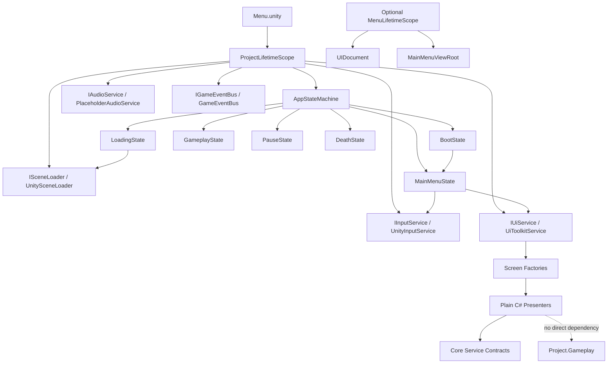

# Main Menu Architecture Analysis

## Scope

This document analyzes the current Dead Echo project architecture before implementing the main menu with UI Toolkit. It does not implement runtime code. The goal is to define the integration path for the menu without duplicating systems, bypassing VContainer, or coupling UI directly to gameplay.

## Current State Found

### Folder and Assembly Structure

The project already uses the intended modular structure under `Assets/_Project`:

- `Core`
- `Gameplay`
- `AI`
- `Audio`
- `UI`
- `Narrative`
- `Infrastructure`
- `Editor`
- `Tests`

The relevant assemblies currently are:

- `Project.Core`: no assembly references. Contains shared contracts, the app state machine, and state classes.
- `Project.UI`: references `Project.Core`. Currently contains `PlaceholderUiService`.
- `Project.Audio`: references `Project.Core`. Currently contains `PlaceholderAudioService`.
- `Project.Infrastructure`: references `Project.Core`, `Project.Audio`, `Project.UI`, `Unity.InputSystem`, `VContainer`, and `VContainer.Unity`. This is the current composition and technical adapter layer.
- `Project.Gameplay`: references `Project.Core`.
- `Project.Tests`: references `Project.Core` and Unity test assemblies.

This direction is compatible with a UI Toolkit menu if UI code remains inside `Project.UI` and only depends on `Project.Core` contracts.

### VContainer and Composition Root

The active composition root is `ProjectLifetimeScope` at:

`Assets/_Project/Infrastructure/DependencyInjection/ProjectLifetimeScope.cs`

It currently registers:

- `InputActionAsset`
- `IGameEventBus` -> `GameEventBus`
- `ISceneLoader` -> `UnitySceneLoader`
- `IInputService` -> `UnityInputService`
- `IAudioService` -> `PlaceholderAudioService`
- `IUiService` -> `PlaceholderUiService`
- `AppStateMachine`
- `AppStateMachineStartup` as an entry point

`SceneLifetimeScope` exists, but its `Configure` method is empty. It is ready for scene-specific services later, but it is not yet needed by the main menu.

`Menu.unity` already contains a `ProjectLifetimeScope` object with `autoRun` enabled and the `DeadEchoInputActions.inputactions` asset assigned.

### Application Startup and App State Flow

Startup currently happens through:

1. `ProjectLifetimeScope.Configure`
2. `AppStateMachineStartup.Start`
3. `AppStateMachine.ChangeState(AppStateId.Boot)`
4. `BootState.Enter`
5. `BootState` immediately transitions to `MainMenuState`

The current app states are:

- `BootState`
- `MainMenuState`
- `LoadingState`
- `GameplayState`
- `PauseState`
- `DeathState`

Input activation is already controlled by states:

- `BootState`: disables gameplay and UI input.
- `MainMenuState`: disables gameplay input and enables UI input.
- `LoadingState`: disables gameplay input.
- `GameplayState`: disables UI input and enables gameplay input.
- `PauseState`: disables gameplay input, enables UI input, and sets `Time.timeScale` to `0`.
- `DeathState`: disables gameplay input and enables UI input.

The missing piece is that states do not yet call `IUiService` or `ISceneLoader`. `MainMenuState` only enables UI input and logs that the main menu is active.

### Scene Loading

`ISceneLoader` exists in `Project.Core`.

`UnitySceneLoader` exists in `Project.Infrastructure.SceneLoading` and wraps `SceneManager.LoadSceneAsync(sceneName)`.

Current limitations:

- Scene loading is string-based.
- There is no scene catalog/config asset yet.
- `LoadingState` does not yet call `ISceneLoader`.
- `EditorBuildSettings.asset` currently contains only `Assets/OutdoorsScene.unity` disabled. `Assets/_Project/Scenes/Menu.unity` and `Assets/_Project/Scenes/Game_01.unity` are not currently registered as enabled build scenes.

### Save System

No save service or save data abstraction was found under `Assets/_Project`.

`Load Game` should therefore be implemented against a small `ISaveGameService` contract later, with a placeholder/null implementation until the real save system exists. The UI should not call file APIs, serialization APIs, or `PlayerPrefs` directly.

### Settings System

No settings service was found.

No direct `PlayerPrefs` usage was found in project code. This is good: the future settings menu should preserve that by using a settings contract instead of direct persistence calls from UI screens.

Recommended future contracts:

- `ISettingsService`
- `ISettingsRepository`
- `GameSettings`
- `AudioSettings`
- `GraphicsSettings`
- `ControlSettings`

`PlayerPrefs` can be used behind an infrastructure adapter if needed, but should not leak into presenters, views, or state classes.

### Input System

The project uses Unity New Input System through:

`Assets/_Project/Infrastructure/Input/DeadEchoInputActions.inputactions`

The current `IInputService` exposes:

- `Move`
- `Look`
- `IsRunning`
- `IsCrouching`
- `IsGameplayInputEnabled`
- `IsUiInputEnabled`
- `InteractPressed`
- `UsePressed`
- `PausePressed`
- `EnableGameplayInput`
- `DisableGameplayInput`
- `EnableUiInput`
- `DisableUiInput`

`UnityInputService` owns the `InputActionAsset` access and clones the asset. This is the correct direction. Main menu code should consume `IInputService` only for high-level events where needed, and let UI Toolkit handle normal focused navigation where possible.

Current input maps:

- `Gameplay`: `Move`, `Look`, `Run`, `Crouch`, `Interact`, `Use`, `Pause`
- `UI`: `Navigate`, `Submit`, `Cancel`, `Pause`

The `UI` map is prepared, but `IInputService` does not currently expose `Cancel`, `Submit`, or navigation events. UI Toolkit can still receive input through Unity's event system path, but explicit menu back/confirm behavior may need small additions later.

### Audio

`IAudioService` exists in `Project.Core`.

`PlaceholderAudioService` exists in `Project.Audio.Services`.

No `AudioMixer` assets were found under `Assets/_Project`, and no concrete audio settings integration exists. The Audio screen should initially target a future `IAudioSettingsService` or `ISettingsService`, while menu click/hover sounds can route through `IAudioService.Play(eventId)`.

### UI

`IUiService` exists in `Project.Core`, but it is minimal:

- `ShowScreen(string screenId)`
- `HideScreen(string screenId)`

`PlaceholderUiService` logs requests only.

No UI Toolkit assets were found:

- No `.uxml`
- No `.uss`
- No `UIDocument`
- No existing presenter/view/controller pattern

No UGUI menu implementation was found. `com.unity.ugui` is installed, but there is no project UI code using it.

### Tests

`Project.Tests.asmdef` exists, but no EditMode or PlayMode test scripts were found under `Assets/_Project/Tests`.

The current state machine is plain C# enough to test in EditMode. The future UI presenters should also be plain C# where possible and tested without loading scenes.

## Recommended Architecture

### Ownership

Use the existing `ProjectLifetimeScope` as the owner for project-scope menu services.

Do not introduce a second root scope for the menu. The main menu is part of application startup and should be composed by the same root composition path that starts `AppStateMachine`.

Create a `MenuLifetimeScope` only if the menu scene begins to own scene-local objects that should not survive scene changes, such as a scene-specific `UIDocument`, menu-only camera setup, or menu-only effects. If introduced, it should be a child scene scope, not a replacement for `ProjectLifetimeScope`.

### Service Registration

`IUiService` should remain registered in `ProjectLifetimeScope` because it is a global application service used by states and potentially pause/death flows.

Replace `PlaceholderUiService` with a UI Toolkit implementation later:

- `IUiService` -> `UiToolkitService`

The implementation should live in `Project.UI`, because it owns UI Toolkit screens and view logic. `Project.Infrastructure` may still register it because the composition root currently depends on `Project.UI`.

### UIDocument Registration

The root `UIDocument` is a scene object and should not be hidden behind a global static lookup.

Recommended setup:

- Add a root `UIDocument` GameObject to `Menu.unity`.
- Add a small `UiDocumentProvider` or `MainMenuViewRoot` MonoBehaviour in `Project.UI`.
- Register that component in the menu scene scope with VContainer.

If no `MenuLifetimeScope` is created yet, `ProjectLifetimeScope` can serialize a reference to the root `UIDocument` or root provider and register it. This is acceptable for the initial main menu only if the root scope object is in the same `Menu.unity` scene.

Preferred next step:

- Keep `ProjectLifetimeScope` for global services.
- Add `MenuLifetimeScope` for scene-local UI objects if the menu root `UIDocument` should be resolved by presenters.
- Parent `MenuLifetimeScope` to `ProjectLifetimeScope`.

### Screen Creation and Removal

For UI Toolkit, avoid instantiating one MonoBehaviour per screen when the screen can be a plain C# presenter/controller.

Recommended structure:

- One root `UIDocument` owns the visual tree.
- UXML files define screen layouts.
- USS files define styling.
- `UiToolkitService` controls screen stack and modal stack.
- Screen presenters are plain C# classes.
- Each presenter binds to a `VisualElement` root and registers/unregisters callbacks.
- `IUiService.ShowScreen(screenId)` maps screen ids to factories.
- `IUiService.HideScreen(screenId)` removes the screen root and disposes presenter bindings.

Modal confirmation should be modeled as a UI-level modal flow, not as gameplay state:

- `Confirm New Game`
- `Confirm Quit`
- `Confirm Load Game Without Save`

The UI service should own modal stacking and focus restore.

### Avoiding Gameplay Coupling

The UI module must not reference `Project.Gameplay`.

Menu actions should call core-level contracts:

- `New Game`: request app transition or scene load through an application/menu flow service.
- `Load Game`: call `ISaveGameService` once it exists, then use `ISceneLoader`.
- `Settings`: call `ISettingsService`.
- `Audio`: call `IAudioService` and settings service.
- `Graphics`: call `ISettingsService`.
- `Controls`: call `IInputService` for remap support later or a dedicated input settings service.
- `Credits` and `Extras`: pure UI screens until data sources exist.
- `Quit`: call an `IApplicationService` or `IApplicationQuitService`, with a Unity adapter in Infrastructure.

Do not inject player controllers, gameplay scene objects, AI systems, or gameplay managers into menu presenters.

### Integrating With AppStateMachine

`MainMenuState.Enter` should eventually call `IUiService.ShowScreen(MainMenu)` and `MainMenuState.Exit` should hide it.

However, `Project.Core` cannot depend on `Project.UI`, so the state must only use `IUiService`.

The state machine currently creates states through `AppStateMachineFactory.CreateDefault(IInputService)`. To integrate UI and scene loading cleanly, expand the factory dependencies later to include the minimum required contracts:

- `IInputService`
- `IUiService`
- `ISceneLoader`
- possibly `IGameEventBus`

Avoid passing concrete UI Toolkit classes into state constructors.

### New Game, Load Game, and Quit

Recommended command flow:

- `MainMenuPresenter` receives button clicks and navigation submit events.
- It calls a plain C# coordinator such as `MainMenuController` or publishes core events through `IGameEventBus`.
- The coordinator uses core services, not gameplay objects.

Initial integration choices:

- `New Game`: transition to `LoadingState`; loading then calls `ISceneLoader.LoadScene("Game_01")` once scene config exists.
- `Load Game`: disabled or shows "No save found" until `ISaveGameService` exists.
- `Quit`: show confirmation modal, then call `IApplicationService.Quit()`.

### Settings Persistence

Do not call `PlayerPrefs` from UI screens.

Recommended layering:

- `Project.Core`: define settings contracts and data models.
- `Project.Infrastructure`: implement persistence adapter, possibly `PlayerPrefsSettingsRepository`.
- `Project.UI`: presenters edit a mutable view model and call `ISettingsService.Apply` / `Save`.
- `Project.Audio`: concrete audio adapter applies volume to mixers once mixers exist.

This keeps persistence decisions outside UI and allows tests to use an in-memory repository.

## Mermaid Diagram

## Classes That Should Be Created

### Core

- `ISaveGameService`: contract for checking, loading, and starting save data.
- `ISettingsService`: contract for reading, changing, applying, and saving settings.
- `IApplicationService`: contract for quit/application-level operations.
- `UiScreenId`: enum or constants for `MainMenu`, `Settings`, `Audio`, `Graphics`, `Controls`, `Credits`, `Extras`.
- Optional `MainMenuCommand` events if using `IGameEventBus` for menu actions.

### UI

- `UiToolkitService`: concrete `IUiService` implementation.
- `UiScreenFactory`: creates screen visual trees and presenters.
- `UiScreenHandle`: disposable handle for mounted screens.
- `MainMenuPresenter`: binds New Game, Load Game, Settings, Credits, Extras, Quit.
- `SettingsPresenter`: controls settings root screen.
- `AudioSettingsPresenter`: controls audio settings.
- `GraphicsSettingsPresenter`: controls graphics settings.
- `ControlsSettingsPresenter`: controls controls/remap screen.
- `CreditsPresenter`: controls credits screen.
- `ExtrasPresenter`: controls extras screen.
- `ConfirmationModalPresenter`: reusable confirmation modal.
- `MainMenuViewRoot` or `UiDocumentProvider`: MonoBehaviour that exposes the root `UIDocument`.

### Infrastructure

- `UnityApplicationService`: implements `IApplicationService` with `Application.Quit` and editor-safe behavior.
- `PlayerPrefsSettingsRepository`: only if settings persistence is needed before a full save/settings backend exists.
- `SceneCatalog` or `SceneReferenceConfig`: stores known scene names without scattering string literals.
- Optional `MenuLifetimeScope`: scene-specific registrations for `UIDocument`, view root, and menu-only presenters.

## Classes That Should Be Altered

- `ProjectLifetimeScope`: replace `PlaceholderUiService` with `UiToolkitService` when implemented; register application/settings/save services as they appear.
- `MainMenuState`: inject `IUiService`; show main menu on enter and hide it on exit.
- `LoadingState`: inject `ISceneLoader`; load the configured gameplay scene instead of only logging.
- `AppStateMachineFactory`: accept additional shared service dependencies required by states.
- `IUiService`: likely expand beyond raw string `ShowScreen` / `HideScreen` to include screen stack, modal flow, or typed ids.
- `Project.UI.asmdef`: may need a reference to `UnityEngine.UIElementsModule` depending on Unity asmdef behavior for UI Toolkit APIs.
- `EditorBuildSettings.asset`: add `Assets/_Project/Scenes/Menu.unity` and `Assets/_Project/Scenes/Game_01.unity` as enabled scenes before scene loading is tested in builds.

## Component Dependencies

Recommended dependency direction:

- `Project.Core` defines contracts and app state concepts.
- `Project.UI` implements menu UI against `Project.Core` contracts.
- `Project.Audio` implements audio services against `Project.Core` contracts.
- `Project.Infrastructure` wires concrete implementations through VContainer and owns Unity technical adapters.
- `Project.Gameplay` consumes `Project.Core` contracts, but should not be referenced by the menu.

Concrete menu dependencies:

- `MainMenuPresenter` -> `IUiService`, `IInputService` if explicit cancel/pause handling is needed, `IAudioService`, `IApplicationService`, `IGameEventBus` or an app/menu coordinator.
- `UiToolkitService` -> `UIDocument` or `MainMenuViewRoot`, screen factories.
- `MainMenuState` -> `IUiService`, `IInputService`.
- `LoadingState` -> `ISceneLoader`, `IInputService`.

Dependencies to avoid:

- UI -> concrete player controller.
- UI -> gameplay scene manager.
- UI -> direct `SceneManager`.
- UI -> direct `PlayerPrefs`.
- UI -> direct `InputActionAsset`.
- Core -> UI Toolkit types.

## Risks Found

- `IUiService` is currently too small for a robust menu stack and modal flow.
- `MainMenuState` does not yet call `IUiService`; menu visibility would currently need an external trigger.
- `LoadingState` does not yet call `ISceneLoader`; New Game cannot load gameplay through the state machine without a small extension.
- Build Settings are not aligned with current scenes; `Menu.unity` and `Game_01.unity` are not enabled in `EditorBuildSettings.asset`.
- Save and settings systems do not exist yet; Load Game and settings persistence need placeholder behavior or disabled UI states.
- Audio has no mixer-backed implementation; audio settings can only be stored as data until mixers exist.
- UI Toolkit navigation depends on correct focus management. Without a central focus policy, keyboard/controller navigation can feel inconsistent.
- `IInputService` exposes UI enable/disable but not UI submit/cancel/navigation events. UI Toolkit may cover this, but explicit modal close/back behavior may require a small extension.
- No UI tests exist yet, so presenter logic should be kept plain C# to make initial EditMode coverage cheap.

## Implementation Plan

1. Add scene entries for `Menu.unity` and `Game_01.unity` to Build Settings.
2. Create UI Toolkit assets under `Assets/_Project/UI/MainMenu`: UXML, USS, and optional shared components.
3. Create `MainMenuViewRoot` MonoBehaviour to expose the root `UIDocument`.
4. Decide whether `MenuLifetimeScope` is needed immediately. Use it if registering scene objects like `UIDocument`; otherwise serialize the root view into `ProjectLifetimeScope` for the first pass.
5. Replace `PlaceholderUiService` with `UiToolkitService` and register it as `IUiService`.
6. Add plain C# presenters for main menu, settings sections, credits, extras, and confirmation modals.
7. Expand `IUiService` minimally for screen stack and modal behavior.
8. Inject `IUiService` into `MainMenuState` and call show/hide there.
9. Add `IApplicationService` and `UnityApplicationService` for Quit.
10. Add placeholder `ISaveGameService` and disable or route Load Game through it.
11. Add `ISettingsService` with in-memory or PlayerPrefs-backed repository behind an adapter.
12. Wire New Game through app flow: menu command -> state transition -> `LoadingState` -> `ISceneLoader`.
13. Add EditMode tests for presenters and state transitions.
14. Add PlayMode smoke test for root scope resolving menu dependencies.

## Dependencies on Systems Not Yet Implemented

- `Load Game` depends on a save system and save slot model.
- Settings persistence depends on `ISettingsService` and a repository adapter.
- Audio sliders depend on mixer-backed audio service or an audio settings applier.
- Graphics settings depend on a graphics settings adapter for resolution, fullscreen, quality, HDRP options, and dynamic resolution.
- Controls/remapping depends on a remap-capable input settings layer above `UnityInputService`.
- New Game depends on a scene catalog and `LoadingState` integration with `ISceneLoader`.
- Credits and Extras depend on data source decisions: static UXML content, ScriptableObjects, or localization/data files.

## Recommended Immediate Decision

For the first implementation pass, keep the root application composition in `ProjectLifetimeScope` and introduce `MenuLifetimeScope` only for scene-local UI objects if the `UIDocument` is registered through VContainer. The menu itself should live in `Project.UI`, use UI Toolkit, and communicate outward only through `Project.Core` contracts. This preserves the current assembly direction and avoids a parallel UI/input/scene-loading stack.
